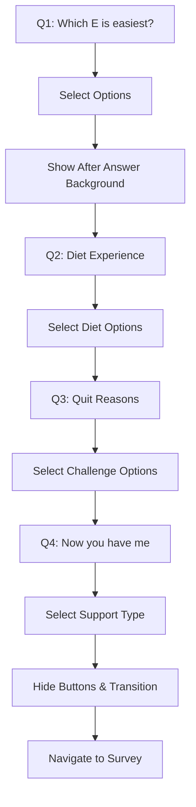

# Onboarding Screen - Product Requirements Document

## 1. Product Overview

The onboarding screen is a critical user acquisition feature that collects essential user preferences and goals to personalize their fitness and nutrition journey. It guides users through 4 progressive questions to understand their exercise preferences, diet experience, challenges, and desired support type.

The onboarding process serves as the foundation for creating personalized recommendations and establishing user engagement patterns from the first interaction.

## 2. Core Features

### 2.1 User Roles

No role distinction is required for the onboarding screen - all new users follow the same flow.

### 2.2 Feature Module

Our onboarding screen consists of the following main components:
1. **Question Flow**: 4-step progressive questionnaire with multiple choice options
2. **Background Transitions**: Dynamic background images that change based on user progress and interactions
3. **Navigation Controls**: Back/Next/Continue buttons with conditional visibility and behavior
4. **Progress Tracking**: Visual feedback through question progression and selection states

### 2.3 Page Details

| Page Name | Module Name | Feature Description |
|-----------|-------------|---------------------|
| Onboarding Screen | Question Display | Display current question with conditional text color (white for Q1-Q3, gray for Q4) |
| Onboarding Screen | Option Selection | Multi-select grid of answer options with visual feedback and selection states |
| Onboarding Screen | Background Management | Dynamic background image transitions based on current step and user interactions |
| Onboarding Screen | Navigation Controls | Back/Next/Continue buttons with conditional visibility and step-specific behavior |
| Onboarding Screen | Transition Animation | Special transition sequence for Q4 completion with button hiding and background animation |
| Onboarding Screen | Data Collection | Store user selections across all questions for profile creation |

## 3. Core Process

### User Flow
1. User enters onboarding screen on Q1: "Which E is the easiest for you?"
2. User selects one or more options from: Eating, Exercise, Entertainment, Education
3. Upon selection in Q1, background briefly changes to "after answer" image for 1 second
4. User clicks "Next" to proceed to Q2: "Have you tried these diets, are they suitable for you?"
5. User selects from diet options: Keto, Paleo, Vegan, Mediterranean, Low-carb
6. User clicks "Next" to proceed to Q3: "Have you ever quit due to…"
7. User selects from challenge options: Lack of time, No results, Too expensive, Too difficult, Boring
8. User clicks "Next" to proceed to Q4: "Now, you have me"
9. Background transitions to "transition - no text.png"
10. User selects from support options: Diet Expert, Fitness Coach, Check-in Friend
11. User clicks "Continue" which triggers special transition sequence:
    - Buttons are hidden
    - Background transitions to "transition 3 - no text.png" with 1-second animation
    - After 2 seconds total, user is navigated to survey screen

## 4. User Interface Design

### 4.1 Design Style

- **Primary Colors**: Black background (#000000), white text (#FFFFFF)
- **Secondary Colors**: Gray text for Q4 (#525252), selected option background (#5A5A5A), unselected option background (#3A3A3A)
- **Button Style**: Rounded rectangular buttons with dark gray background (#808080), white text, 42px height
- **Font**: System default, 24px bold for questions, 16px regular for options
- **Layout Style**: Full-screen with dynamic background images, centered content with padding
- **Animation**: 300ms transitions for option selection, 1-second background transitions

### 4.2 Page Design Overview

| Page Name | Module Name | UI Elements |
|-----------|-------------|-------------|
| Onboarding Screen | Question Text | 24px bold text, white color for Q1-Q3, gray (#525252) for Q4, center-aligned |
| Onboarding Screen | Option Grid | Single column grid, 8:1 aspect ratio, rounded rectangles with 25px border radius |
| Onboarding Screen | Selection States | Selected: #5A5A5A background with white border, Unselected: #3A3A3A background |
| Onboarding Screen | Navigation Buttons | 42px height, dark gray background, white text, 100px minimum width |
| Onboarding Screen | Background Images | Full-screen fit-width images with center alignment |
| Onboarding Screen | Check Icons | White circle with blue checkmark for selected options |

### 4.3 Responsiveness

The onboarding screen is designed mobile-first with full-screen layout that adapts to different screen sizes. Touch interactions are optimized for mobile devices with appropriate touch targets and visual feedback.

## 5. Technical Requirements

### 5.1 State Management
- Current step tracking (`_currentStep`)
- Selected options storage (`_selectedOptions` array)
- Background state flags (`_showAfterAnswerBackground`, `_showTransitionBackground`)
- Button visibility control (`_hideButtons`)

### 5.2 Assets Required
- `onboarding Q1 after answer - no text.png`
- `onboarding Q2 - no text.png`
- `onboarding Q3 - no text.png`
- `transition - no text.png`
- `transition 3 - no text.png`

### 5.3 Navigation
- Route to `/survey` with collected data as arguments
- Data structure: exercisePreferences, dietExperience, quitReasons

## 6. Success Metrics

### 6.1 Completion Metrics
- Onboarding completion rate (users who complete all 4 questions)
- Drop-off rate per question step
- Average time spent per question
- Selection patterns across different options

### 6.2 User Experience Metrics
- User satisfaction with onboarding flow
- Accuracy of collected preferences (validated through subsequent user behavior)
- Transition animation performance and smoothness

### 6.3 Technical Metrics
- Screen load time
- Animation performance (60fps target)
- Memory usage during background transitions
- Error rates in navigation flow

## 7. Future Enhancements

- Progress indicator showing completion percentage
- Skip option for advanced users
- Personalized question branching based on previous answers
- A/B testing framework for different question variations
- Analytics integration for detailed user behavior tracking